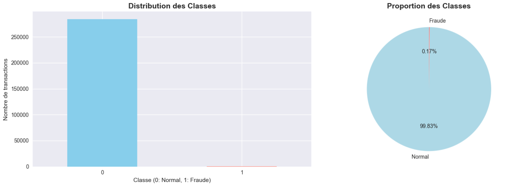

# 📊 Fraud Detection System (EDA)

## 🚀 Description
Projet d'analyse exploratoire des données (EDA) sur un dataset de transactions bancaires afin de détecter les schémas de fraude.  
Le dataset est fortement déséquilibré (fraudes <1%), ce qui représente un vrai défi en data science.

## 🎯 Objectifs
- Analyser la distribution des transactions normales et frauduleuses
- Étudier les montants et les patterns temporels
- Explorer les features PCA anonymisées
- Détecter les outliers et anomalies
- Proposer des recommandations pour la modélisation (SMOTE, Isolation Forest, Autoencoder, etc.)

## 🛠️ Outils & Technologies
- **Python** (Pandas, NumPy, Matplotlib, Seaborn, Scikit-learn)
- Visualisation avancée (boxplots, heatmaps, violin plots, PCA)
- Techniques d’analyse statistique et détection d’outliers

## 📂 Dataset
- Source : [Kaggle - Credit Card Fraud Detection](https://www.kaggle.com/datasets/mlg-ulb/creditcardfraud)
- 284,807 transactions, 492 fraudes (0.17%)

## 📊 Résultats Clés
- Forte imbalance des classes (1:577)
- Montants frauduleux souvent plus élevés que les normaux
- Features PCA discriminantes identifiées (V17, V14, V12…)
- Recommandations : utiliser Precision-Recall plutôt qu’Accuracy

## 📸 Visualisations
## Exploratory Data Analysis (EDA)

## 🔮 Perspectives
- Développement d’un modèle prédictif basé sur Random Forest / XGBoost
- Test d’approches non supervisées (Isolation Forest, Autoencoder)
- Évaluation avec métriques adaptées (AUC-PR, F1-score)

---
